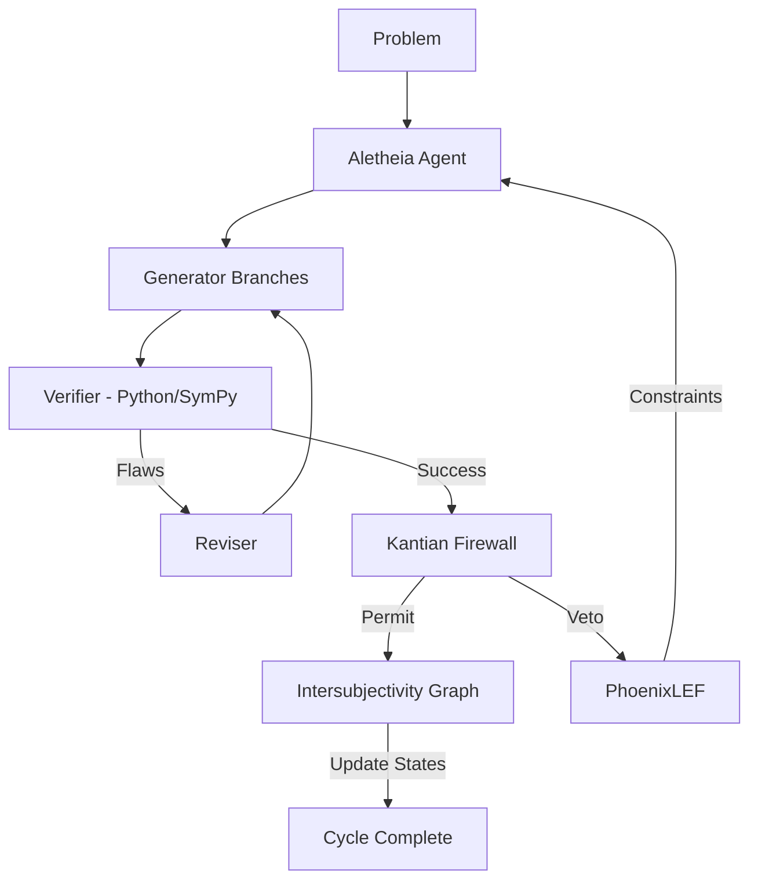

# v7.0 System Architecture: The Intersubjective Engine

## Layered Model

1. **Epistemic Layer (Julia)**: Handles the Intersubjectivity Graph and Auseinandersetzung negotiation. Uses MetaGraphsNext.jl for high-performance attributed graphs.
2. **Reasoning Layer (Aletheia Agent)**: Implements the Generator-Verifier-Reviser triad. Manages parallel thinking branches and failure admission.
3. **Verification Layer (Python)**: Executes CPU-bound symbolic tasks using SymPy. Implements the Kantian Firewall and structural pattern matching.
4. **Integration Layer (PhoenixLEF)**: Ensures system self-regeneration by transforming failures into constraints for future cycles.

## Component Interaction

## Module Descriptions

- `MetateoriaIntersubjetiva`: Graph engine for agent negotiation.
- `AletheiaAgent`: Parallel search orchestrator.
- `KernelQuanticoSimbolicoV7`: Symbolic superposition and invariant extraction.
- `FirewallAGI`: Three-formulation Kantian ethics checker.
- `DeepThinkVerifier`: Symbolic truth-checking backend.
- `AutomatoResolver`: Multi-agent emergence simulation.
